# 🕌 Islami App

  

---

## 📱 About The App

**Islami App** is a Flutter-based application that provides Islamic content in a simple and clean interface.  
It allows users to browse **Quranic Surahs**, **Hadiths**, use a **digital Tasbih**, listen to **Islamic radio**, and view **prayer times**.

The app focuses on **simplicity, usability, and saving user history locally** using **Shared Preferences**.

---

## ✨ Features

- 📖 **Quran**
  - Browse and view Quranic Surahs in Arabic
  - Track the most recently opened Surahs
  - Save reading history using Shared Preferences

- 📜 **Hadiths**
  - Browse Hadiths in Arabic
  - Track the most recently opened Hadiths

- 🔹 **Tasbih**
  - Digital Tasbih counter for dhikr

- 📻 **Radio** *(Not yet implemented)*

- 🕋 **Prayer Times** *(Not yet implemented)*

- 📦 **Packages Used**
  - animate_do
  - shared_preferences
  - carousel_slider
  - smooth_page_indicator
  - animated_rotation
  - cupertino_icons

---

## 🛠️ Tech Stack

- **Flutter & Dart SDK ^3.8.1**
- **Shared Preferences** for storing history
- **Cached Images & Animations** using animate_do and carousel_slider
- **Custom Fonts**: Janna LT Bold & Regular

---

## 📸 Screenshots

### 🔹 Splash Screen

  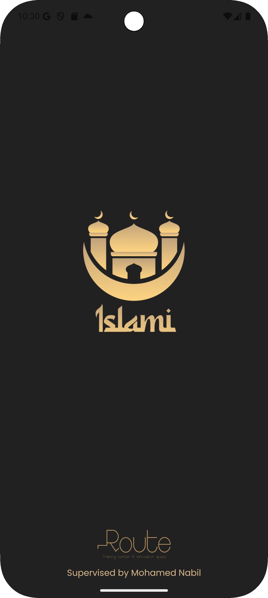

---

### 🔹 Onboarding

  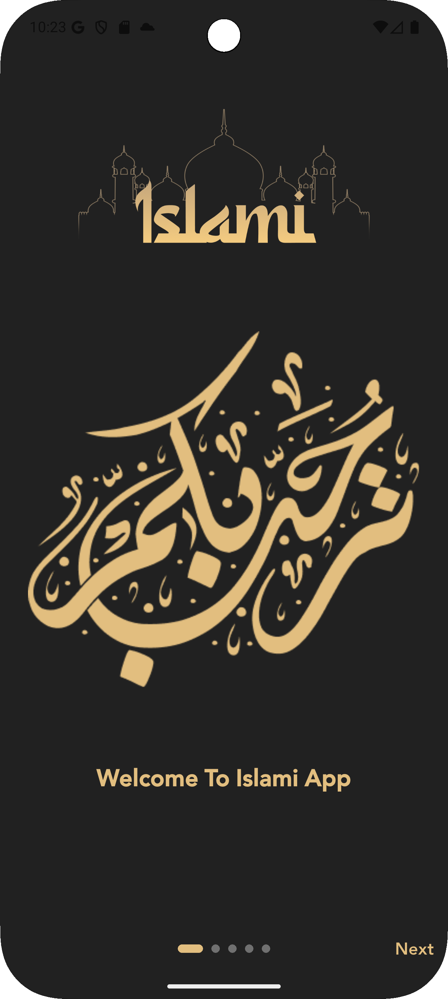
  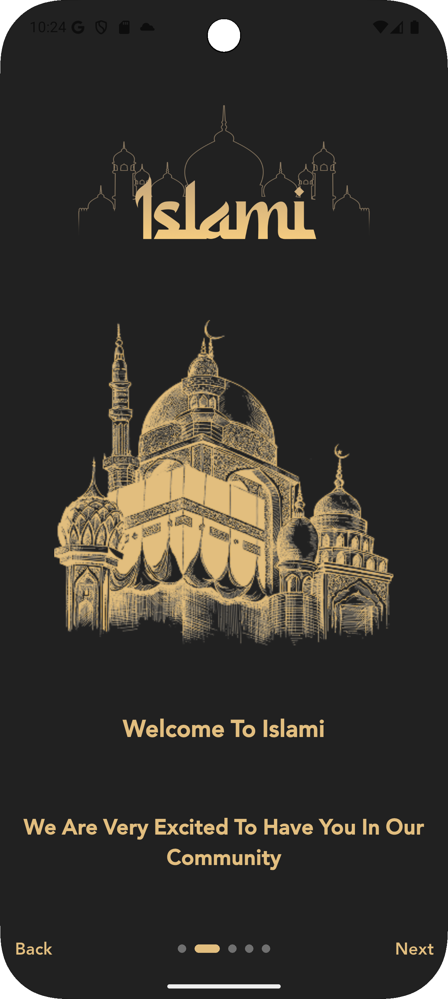
  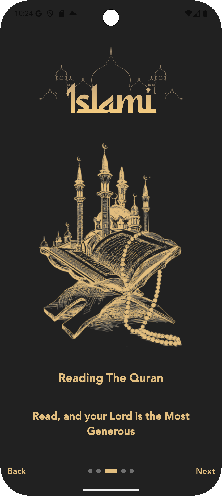

  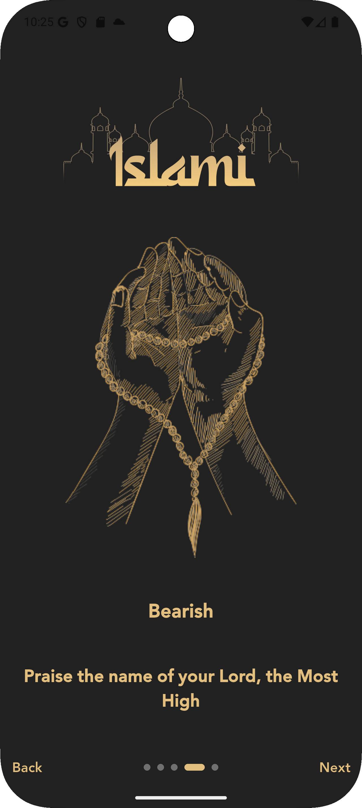
  

---

### 🔹 Quran

  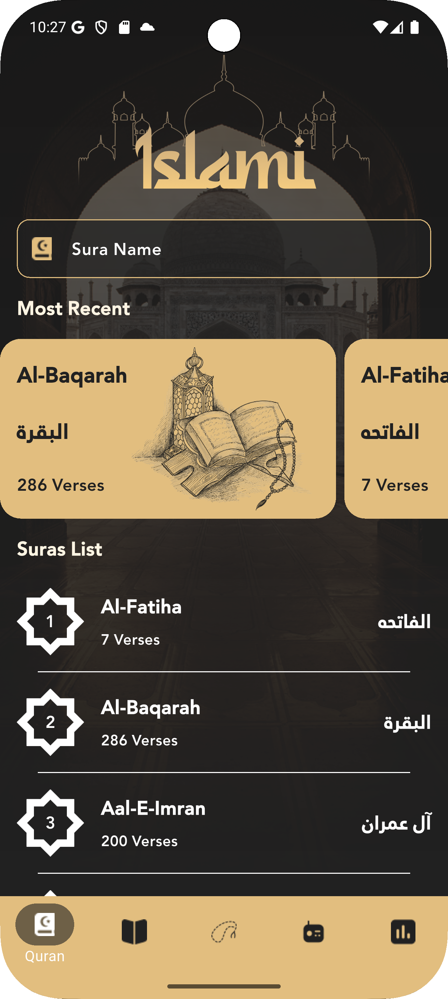
  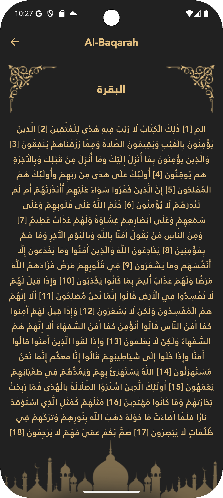
  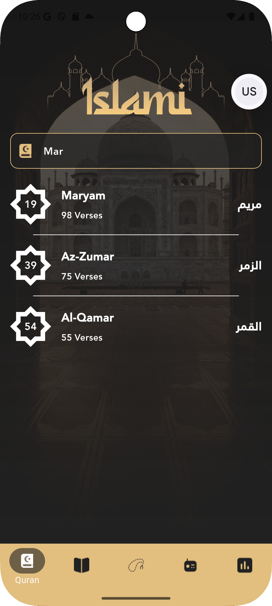

---

### 🔹 Hadith

  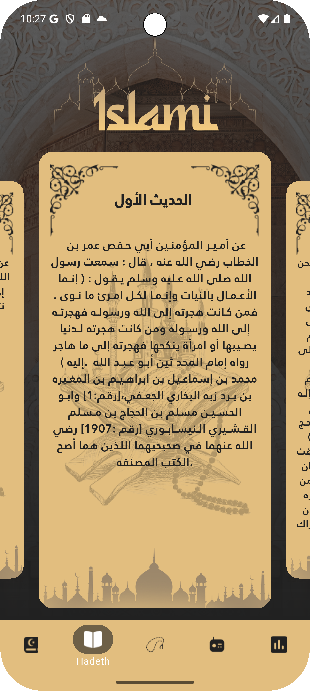
  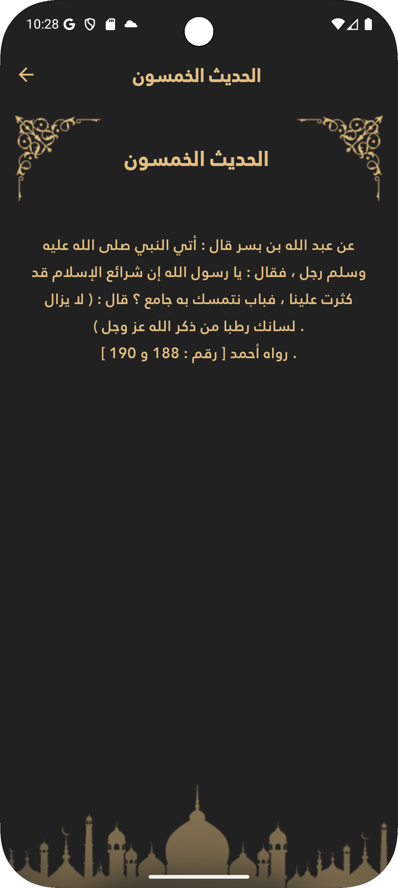

---

### 🔹 Tasbih

  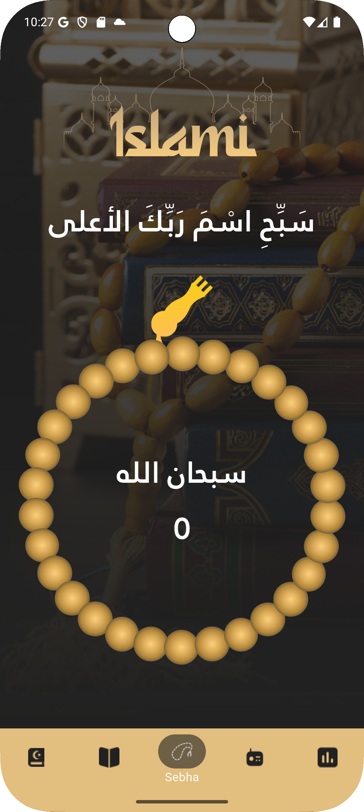

---

## 🚀 Getting Started

1. Clone the repository:
   git clone https://github.com/BassantMohamed1/Islami-app.git

2. Go to the project folder:
   cd Islami-app

3. Install dependencies:
   flutter pub get

4. Run the app:
   flutter run

Made with ❤️ using Flutter
